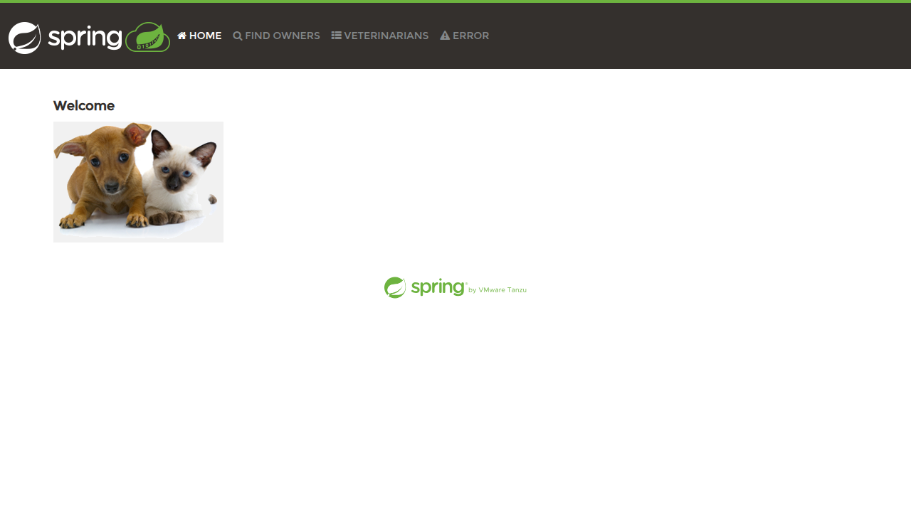

# Spring PetClinic - Containerization & Deployment Guide

## Overview
This document describes the containerization and Kubernetes deployment of the Spring PetClinic application.

## Docker Image

### Image Details
- **Image Name**: `spring-petclinic:1.0`
- **Image Size**: 399MB
- **Base Image**: eclipse-temurin:17-jre-jammy
- **Security**: Non-root user (spring:spring)
- **Platform**: linux/amd64

### Build Instructions
The application is built locally first (due to SSL certificate constraints in containerized Maven), then packaged into a Docker image:

```bash
# Build JAR
./mvnw clean package -DskipTests

# Build Docker image
docker build --platform linux/amd64 -t spring-petclinic:1.0 .
```

### Run Locally
```bash
docker run -p 8080:8080 spring-petclinic:1.0
```

Access the application at: http://localhost:8080

## Kubernetes Deployment

### Cluster Setup
The application is deployed to a local KIND (Kubernetes IN Docker) cluster:

```bash
# Create KIND cluster
kind create cluster --name petclinic

# Load image into KIND
kind load docker-image spring-petclinic:1.0 --name petclinic
```

### Deploy to Kubernetes
```bash
# Apply manifests
kubectl apply -f k8s/

# Check deployment status
kubectl get pods -n app -l app=spring-petclinic
kubectl get svc -n app
```

### Access the Application
The application is deployed as a ClusterIP service. Access it via port-forward:

```bash
# Port-forward to local machine
kubectl port-forward -n app service/spring-petclinic 8080:8080

# Access at http://localhost:8080
```

### Deployment Configuration

**Namespace**: `app`

**Resources**:
- **Deployment**: spring-petclinic (2 replicas)
- **Service**: spring-petclinic (ClusterIP on port 8080)
- **ConfigMap**: spring-petclinic-config (H2 database configuration)

**Resource Limits**:
- CPU Request: 500m, Limit: 1000m
- Memory Request: 512Mi, Limit: 1Gi

**Health Checks**:
- Liveness: TCP socket on port 8080
- Readiness: HTTP GET on `/actuator/health/readiness` endpoint

### Verification
```bash
# Check pod status
kubectl get pods -n app -l app=spring-petclinic

# Check logs
kubectl logs -n app deployment/spring-petclinic

# Test endpoint
kubectl exec -n app deployment/spring-petclinic -- wget -q -O- http://localhost:8080/
```

## Files Modified/Created

### Docker Files
- `Dockerfile` - Production-ready container image definition
- `.dockerignore` - Build context optimization

### Kubernetes Manifests
- `k8s/deployment.yaml` - Application deployment configuration
- `k8s/service.yaml` - Service exposure
- `k8s/configmap.yaml` - Application configuration (H2 database)

### Artifacts
- `artifacts/tool-call-checklist.md` - Detailed tool execution log
- `artifacts/app.png` - Screenshot of running application

## Application Details
- **Framework**: Spring Boot 4.0.0
- **Java Version**: 17
- **Database**: H2 (in-memory)
- **Port**: 8080
- **Context Path**: /

## Screenshot


The screenshot shows the Spring PetClinic application successfully running in the KIND Kubernetes cluster, accessible via port-forward.

## Notes
- The application uses H2 in-memory database for simplicity
- Pods take approximately 15-20 seconds to start
- Health probes are configured with appropriate delays for startup time
- The deployment is configured for production with resource limits and health checks
